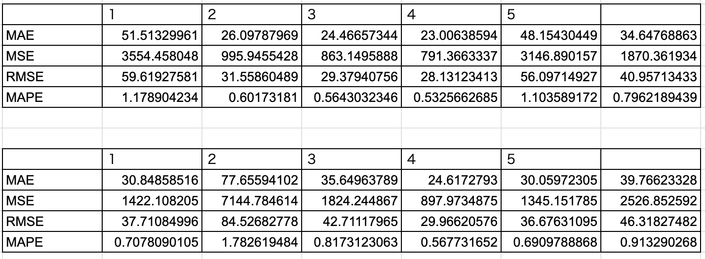
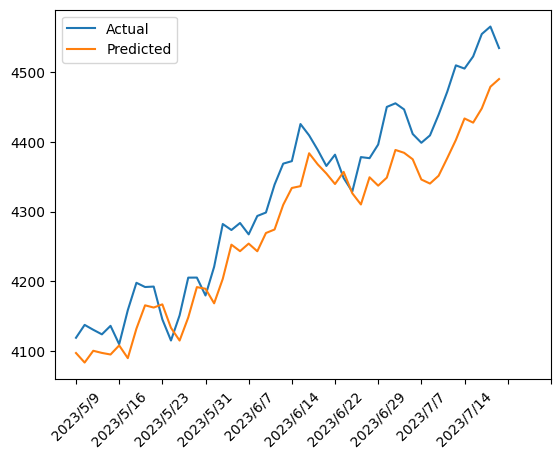
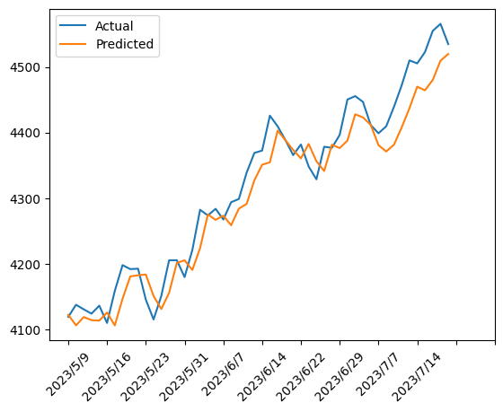

# S&P500ツイッター・センチメント指数を利用した、S&P500の予測

# 概要

- 本実験では、米国市場の経済指標として使用されているS&P500についての予測手法について研究する。
- S&P Dow Jones Indicesが公開しているS&P500ツイッター・センチメント指数がS&P500の予測精度向上に寄与するかを確かめるために、時系列予測モデルを構築し、精度の比較検証を行う。
- 最初に、S&P500の値動きとS&P500ツイッター・センチメント指数の動きの相関を確認し、その後時系列データを予測すための深層学習モデルに入力をして精度を比較する。

# 目的
- S&P500ツイッター・センチメント指数がS&P500の予測精度向上に寄与するかを確かめる

# ディレクトリ構成と解説

~~~
SP500_Twitter_Sentiment
├ readme.md
├ data
│ ├ S&P500_finance.csv
│ ├ S&P500_sentiment.csv
│ ├ output1.png
│ ├ output2.png
│ └ result_table.png
└ code
　 ├ correlation.ipynb
　 └ example.ipynb
~~~
- data
    - S&P500_finance.csv：&P500の株価データ
    - S&P500_sentiment.csv：S&P500のTwitterセンチメント指数
    - output1.png：予測結果のグラフ（S&P500のみ）
    - output2.png：予測結果のグラフ（S&P500Twitterセンチメント指数あり）
    - result_table.png：結果テーブル
- code
    - correlation.ipynb：データの確認や相関関係を表したコード
    - example.ipynb：時系列予測実験コード

# データ

- S&P500
    - データ概要
        - スタンダード・アンド・プアーズ500種指数と呼ばれ、米国市場の中で上場している企業の中から500企業を選定し、その銘柄の株価を元にした時価総額加重平均型株価指数である。
    - 取得期間
        - 2022/7/20~2023/7/20
        - （閉場日は今回の値に含まれていない）
    - 取得先
        - Investing.comより取得
        - https://jp.investing.com/indices/us-spx-500-historical-data

- S&P500のTwitterセンチメント指数
    - データ概要
        - TwitterとS&P Dow Jones Indicesが作成した、S&P 500の企業に関するツイートの感情指標である。
        - S&P500に属する企業のティッカーシンボル（$マーク付きの略称）を使用してツイートを抽出し、独自の自然言語処理技術を用いて企業の評判をスコア化している。
        - この指数は、S&P500の構成銘柄の中で最もポジティブなセンチメントを持つ200銘柄を選定し、算出している。
        - [センチメント指数に関する公式ドキュメント](https://www.spglobal.com/spdji/en/documents/methodologies/methodology-sp-twitter-sentiment-indices.pdf?utm_source=pdf_education)
    - 取得期間
        - 2022/7/20~2023/7/20
        - （閉場日は今回の値に含まれていない）
    - 取得先
        - S&P Dow Jones Indicesより取得
        - https://www.spglobal.com/spdji/jp/indices/strategy/sp-500-twitter-sentiment-index/#overview

# 実験環境構築

| 環境 | 名称 |
| ---- | ---- |
| 言語 | Python 3.10.4 |
| 実行環境| Anaconda 22.9.0|
| 計算機OS | Ubuntu 20.04.6（Dual-titan） |

| Pythonライブラリ | バージョン |
| ---- | ---- |
| pandas |  1.5.0 |
| numpy | 1.23.1 |
| matplotlib | 3.7.1 |
| sklearn | 0.0 |
| tensorflow | 2.10.0 |
| seaborn | 0.12.2 |
| scipy | 1.11.1 |

# 結果

- ５回試行した時の平均

    | 評価指標 | S&P500のみ | S&P500Twitterセンチメント指数あり|
    | ---- | ---- | ---- |
    | MAE |  34.65 | 39.77 |
    | MSE | 1870.36 | 2526.85 |
    | RMSE | 40.96 | 46.32 |
    | MAPE | 0.80 | 0.91 |

    - 平均的に見ると、S&P500のみで学習させた方が精度が良いことがわかる。
    - MAPEを見る限り、両モデルそれぞれにおいてまだ改善が必要であることがわかる。

- 表１：５回試行した時の結果（上：S&P500のみ、下：S&P500Twitterセンチメント指数あり|）

    - 個別の試行で見た場合、S&P500が勝っている試行とS&P500Twitterセンチメント指数ありが勝っている試行があり、どちらが良い手法かを決定付ける結果とはならなかった。
    - 精度が高くなる場合と精度が低くなる場合の差が激しく、不安定である。
- グラフ１：S&P500のみ（例：５回目の試行結果）
 
    - 予測値は実測値の後を追うような形のグラフを描画している。
    - 大きな外れ値は見当たらなかった。
- グラフ２：S&P500Twitterセンチメント指数あり（例：５回目の試行結果）
 
    - グラフ１と同様で、出力された予測値は実測値の後を追うような形のグラフを描画している。
    - こちらのグラフにおいても、大きな外れ値はなかった。

# 考察
- 本実験で使用したモデルはLSTM使用しており、中間的に時系列情報を考慮するため、結果として予測値が実測値の後を追う挙動を見せたと考えられる。
- 精度が全体的に不安定なのは、予測に深層学習モデルを使用したためであると考えられる。
    - モデル構築においては、出力の安定性について改善の余地があると判断できる。
    - 出力の安定性が達成されない限り、S&P500Twitterセンチメント指数の予測精度向上への貢献性を確かめることはできない。

# 反省点&感想
- 本実験では、モデル１は入力層１つ、モデル２は入力層２つとモデル構造が異なるため、実質的に比較として適切な手法であるか疑問が残る部分があった。再度、実験設定やモデル構造を見直し、完全な結果が得られるよう改善させたい。
- モデル学習時のepoch数やバッチサイズを深く考えずに設定してしまった。本来であれば、この部分も複数回の試行を重ねて定めるべきであると感じた。（時間の関係上このプロセスを省略してしまいました。）

# まとめ
- S&P500とS&P500Twitterセンチメント指数に正の相関が見られた。
- ５回試行し平均して得た結果では、S&P500のみで学習させた方が精度が良いことがわかった。
- モデルのチューニングがうまくいかなかったため、S&P500Twitterセンチメント指数が予測精度の向上に寄与するかを完全に確かめることはできなかった。

---
### **プロフィール**
明治大学大学院　先端数理科学研究科 ネットワークデザイン専攻

機械学習システム研究室　

安田健士郎

---

### **更新情報**
- 2023/09/19：Githubへpush
- 2023/09/20：プロフ変更